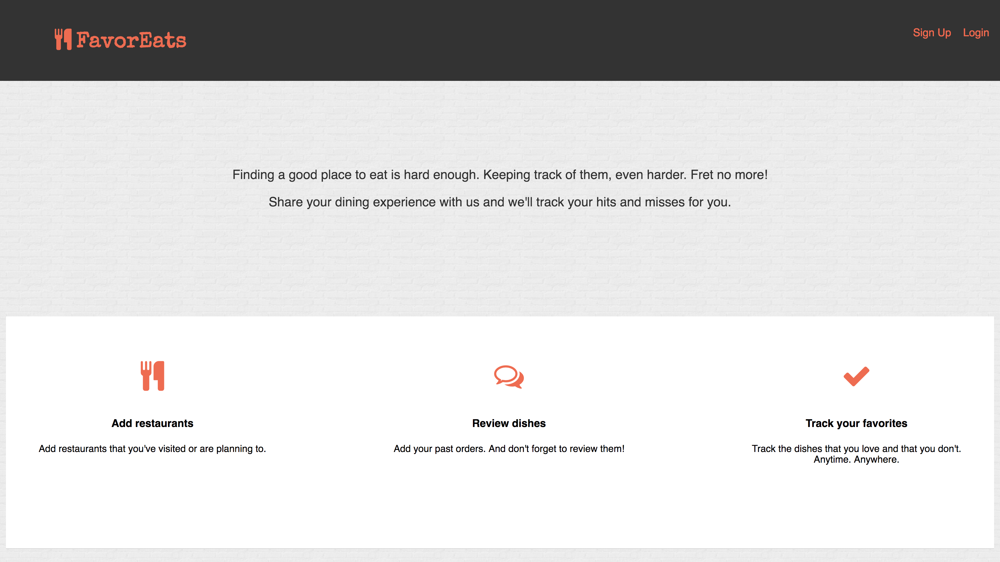
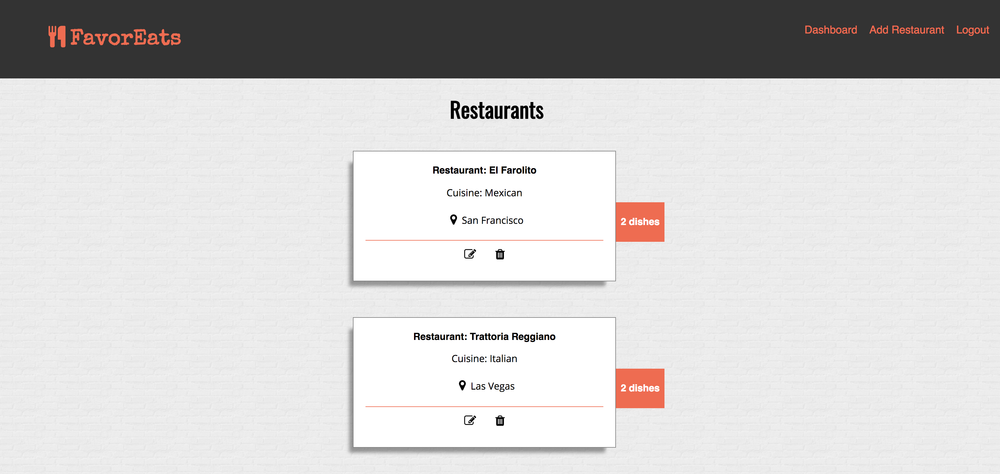
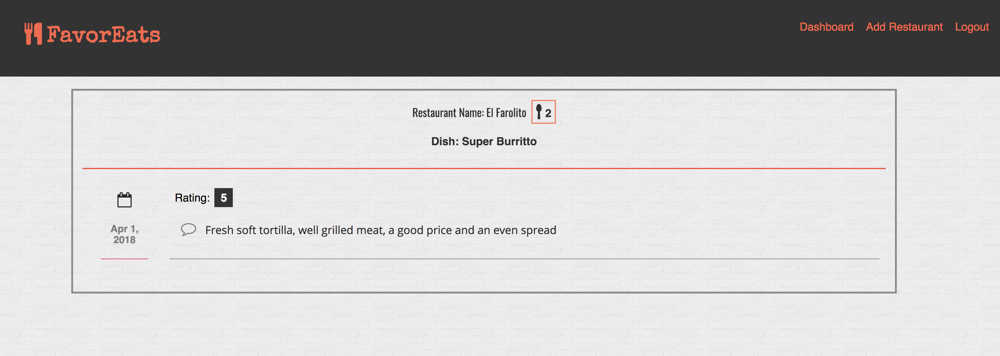

# FavorEats
FavorEats is an app that helps users log their favorite restaurants and dishes. User can add dishes and review them thereby
keeping track of the hits and misses.

## Technology Used

### Front End
- React
- Redux
- Redux-form
- Redux-Thunk
- HTML5
- CSS3

### Back End
- Node.js
- Express
- Mongoose
- MongoDB

### Testing and Deployment

- Enzyme
- Jest
- Mocha
- Chai
- Netlify
- Travis CI
- Heroku
- mLab

## Screenshots

